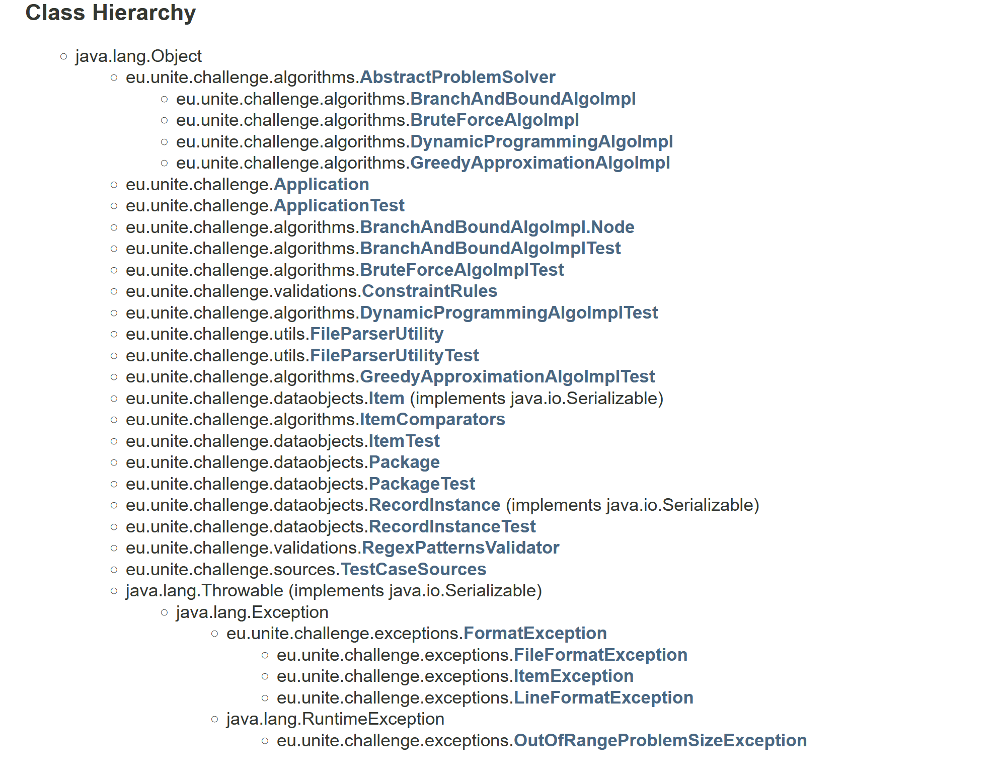

# Unite Package Challenge

1) Problem Description
1) Requirements Analysis
2) Design principles and Decisions
3) Designing Solution
4) Main Tasks of Development and Development Progress Tracking Through Github Issues
5) Running the code
6) Testing the code
7) References

## 1. Problem Description

You want to send your friend a package with different items. You can choose from a number of `N` items. The items are numbered from 1 to `N`. Each one of these items has a given weight and a given cost (in €), where the weights and costs of the items might be different. The package itself has a weight limit. The combined weight of the items you put in the package must not exceed the weight limit of the package, otherwise the package would be too heavy.
Your goal is to determine which items to put in the package so that the total cost of the items you put inside is as large as possible. In case the total cost the of the packaged items is the same for two sets of items, you should prefer the combination of items which has a lower total weight.

### 1.1 Constraints

1. The maximum weight that a package can hold must be <= 100.
2. There may be up to 15 items you can to choose from.
3. The maximum weight of an item should be <= 100.
4. The maximum cost of an item should be <= €100.

### 1.2 Program Specification

Write a program, preferably in Java or another JVM language, which can be run on the command line in order to solve this problem. The program should take one command line argument, which contains the path to a text file. This text file should contain several lines, each line describing one test case for the problem.

Each line starts with the maximum weight of the package for this test case. It is followed by ` : ` and then the list of descriptions of the items available for packaging. Each item description contains, in parentheses, the item's number, starting at 1, its weight and its cost (preceded by a € sign).

In case of a constraint violation, your program should indicate this fact to the user, for example by throwing an exception with a descriptive message, allowing the user to address this problem.

### 1.3 Sample Input

A sample input file looks like this:

```
81 : (1,53.38,€45) (2,88.62,€98) (3,78.48,€3) (4,72.30,€76) (5,30.18,€9) (6,46.34,€48)
8 : (1,15.3,€34)
75 : (1,85.31,€29) (2,14.55,€74) (3,3.98,€16) (4,26.24,€55) (5,63.69,€52) (6,76.25,€75) (7,60.02,€74) (8,93.18,€35) (9,89.95,€78)
56 : (1,90.72,€13) (2,33.80,€40) (3,43.15,€10) (4,37.97,€16) (5,46.81,€36) (6,48.77,€79) (7,81.80,€45) (8,19.36,€79) (9,6.76,€64)
```

### 1.4 Sample Output

The solution for each test case should be printed out on a single line. On this line you should list the item numbers of the individual items to be put in the package to solve the problem. The numbers should be separated by commas. If no combination of items matches the requirements, the output should be a single `-`.

The sample output for the sample input file above should look like this:

```
4
-
2,7
8,9
```

## 2. Requirements Analysis
This problem belongs to a well-known family of problems called knapsack problems. The several variants  of this problem can be found in this link. This problem has the following characterizations: 

1. It's a 0-1 knapsack: Each item is either taken or left.
2. If two subsets of items have equal costs, the one which is lighter (has lower weight) prevails.

Like 0-1 knapsack, the problem is an NP-complete problem, meaning there is currently no known **efficient** (i.e., polynomial-time) algorithm to solve it. However,

1. It is weakly NP-complete, meaning it has a pseudo-polynomial-time algorithm. In simpler terms, the issue can be solved in polynomial time if the numerical values involved in the problem specification (such as the weights) are small enough. This is often done via dynamic programming.

2. A variation where we can take fractions of an item (e.g., half of item 3) can be solved efficiently using a greedy algorithm: Items are first sorted in decreasing **efficiency** (= cost / weight). Whole items are taken in order, until the knapsack can't carry any more item. Then, a fraction of the most efficient remaining item is taken. This approach cannot be used for 0-1 knapsacks. However, it can be used as an approximation algorithm. There's a technicality, which allows this simple heuristic to perform arbitrarily bad. But with proper adjustments, we can get a 1/2 approximation: If the maximum possible cost is OPT, the heuristic guarantees a subset of items with cost at least OPT/2.

3. The problem belongs to FPTAS  class of problems. This means that there exist an efficient approximation which can get arbitrarily close to the solution. More formally, for any 0-1 knapsack problem P and any ε>0, we can get a solution whose cost is at least (1-ε)OPT, while running in time polynomial in (|P|, 1/ε), where |P| is the size of the problem.

There are numerous algorithms from which to choose.
Indeed, based on the problem description, the problem size |P| is so small that even brute forcing the solution is feasible. 

To choose the optimal solution, there are few main question that need proper decisions:
1. Is the parameters for the real-world problem are as small?
2. Do weights always have up to two digits after the decimal point?
3. Are costs always whole numbers?
4. What is the encoding of the input file?
5. What is the maximum size of the input file?
6. How do you like to treat an input file which is malformed, after showing an error: Continue processing further lines, or stop the program?

Currently, the client needs N=15 items tops. Tomorrow, there might be a requirement change and N=100. Considering the requirement changes, brute force is not a viable option.
In this solution, we may use brute force to test other algorithms on small instances.


## 3. Design principles and Decisions
That's how we responded to the preceding section's questions: 

1. In this solution, N is considered a small value, but, The real-world solution may require much larger parameters.
2. That's unknown. Write a solution which handles arbitrary number of digits after decimal point.
3. Costs can be positive real numbers.
4. Default to UTF-8, but it needs to be configurable.
5. Put a meaningful amount in configuration file. While it is possible to handle files of any size (by reading them partially or mapping views onto memory), such a change is not substantial and can be postponed.
6. Continue processing further lines.

The other design principles and decision are as follows:

* **Clean Code Practices:** The SOLID principles for clean coding are followed. The goal of the principles is the creation of software structures that is easy to modify and easy to understand.
    - **Single Responsibility Principle:** The single responsibility principle says that each of our classes has to be only used for one purpose.
    - **Open / Closed Principles:** The open/closed principle states that a piece of software is open for extension but closed for modification.
    - **Liskov Substitution Principle:** This principle states that if we have a parent class and a child class, then we can interchange the parent and child class without getting incorrect results.
    - **Interface Segregation Principle:** This principle states that if we have a parent class and a child class, then we can interchange the parent and child class without getting incorrect results.
    - **Dependency Inversion Principle:** This principle states that high-level modules shouldn’t depend on low-level modules and they both should depend on abstractions, and abstractions shouldn’t depend upon details. Details should depend upon abstractions.

* **Parallelism** `parallelStream` is used to split the task on multiple CPU cores. That is, each problem instance is run by the solver on its own CPU core.

* **Exploit immutability:** Effective Java (EJ), item 17 states "minimize mutability." There are so many good reasons to use immutable classes. For this project, it helped a lot when objects where passed between methods. Had it not been for immutability, it would have been possible for one method to inadvertently modify the object. It is a very helpful to annotate classes with JCIP annotations: For instance, immutable classes are annotated with `@Immutable`.

* **Extensive Exception Handling:**  By using exceptions to manage errors, Java programs have the following advantages over traditional error management techniques: 
    
    - Separating Error Handling Code from "Regular" Code
    - Propagating Errors Up the Call Stack
    - Grouping Error Types and Error Differentiation
    
* **Use `final` classes:** This is a direct result of immutability, but even if a class is supposed to have subclasses, one can define it as `abstract` to prevent creation of instances. One the surface, this might seem contrary to the open–closed principle (OCP), but it isn't. In fact, **EJ Item 18** explains how *inheritance violates encapsulation*, and that it's better to use composition over inheritance. Also, **EJ Item 19** lays down principles for designing a class for inheritance: 
  > The only way to test a class designed for inheritance is to write subclasses. If you omit a crucial protected member, trying to write a subclass will make the omission painfully obvious. Conversely, if several subclasses are written and none uses a protected member, you should probably make it private. Experience shows that three subclasses are usually sufficient to test an extendable class. One or more of these subclasses should be written by someone other than the superclass author.

 The only class we designed for inheritance was `AbstractProblemSolver.java`, which has four subclasses: `BranchAndBound`, `BruteForce`, `DynamicProgramming` and `GreedyApproximation`.

* **Minimize access:** The member fields and member methods should have the minimal access. To quote **EJ Item 15** makes these statements:

> The single most important factor that distinguishes a well-designed component from a poorly designed one is the degree to which the component hides its internal data and other implementation details from other components. A well-designed component hides all its implementation details, cleanly separating its API from its implementation. Components then communicate only through their APIs and are oblivious to each others’ inner workings. This concept, known as information hiding or encapsulation, is a fundamental tenet of software design.

> For members of public classes, a huge increase in accessibility occurs when the access level goes from package-private to protected. A protected member is part of the class’s exported API and must be supported forever. Also, a protected member of an exported class represents a public commitment to an implementation detail (Item 19). The need for protected members should be relatively rare.

While most members in our classes could be `private`, accessibility default (a.k.a. package-private) is chosen to facilitate testing in a more modular way (see next).

* **Use test-driven development (TDD):** Writing tests were a bliss. One can modify the design or the implementation, and in a blink of eye verify if it breaks anything. TDD is very useful, especially for agile development where refactoring occurs frequently.

* **Test coverage:** Once unite/integration tests are in place, one can check the coverage of those tests. Anything below 100% coverage shows some statements are not covered during the tests.
* **Use `BigDecimal`** to hold real numbers. `float` and `double` are notorious for handling real numbers, and they are forbidden for storing monetary values (due to rounding issues). Unfortunately, using `BigDecimal` reduced the code readability, since Java does not support operator overloading. Therefore, operations and relations are implemented via methods.

* **Use a linter:** Linters helps in following best practices, as well as a unified convention. I used SonarLint plugin for IntelliJ IDEA. Among other things, it computed the Cognitive Complexity  of the code. In a few cases where the method complexity was beyond the allowable 15, it warned me and I simplidied the code. The result was much better!

* **Technologies:** The following technologies have been used for the development:
    - Java 11
    - Spring Boot
    - lombok
    - Google Guava
    - jcip-annotations
    - Spring Test


## 4. Designing Solution

### 4.1 Packages
The application consists of the following `packages` under the `eu.unite.challenge` top-level package: 
- `algorithms` : contains implemented algorithms to solve the problem
- `dataobjects` : contains the data objects and data structures
- `exceptions` : contains our custom exceptions for this application
- `utils` : contains file parser utility class
- `validations`: contian constraint rules and regex-patterns classes for valiation

### 4.2 Classes


- `Application`: It is based in the top-level package, which contains the program entry point.

- `algorithms`: The classes within the `algorithms` package are presented below:

    - `ItemComparators`: Keeps comparators used by various algorithms. For instance, `priceWeight` is a comparator which first compares two items using their price, and if the prices are equal compares their weight.
    - `AbstractProblemSolver` is the main class marked for inheritance. Various algorithms which want to solve the problem can implement this method. The constructor of  `AbstractProblemSolver` receives an instance of `RecordInstance`, calls `solve`, and initializes the field `Package package` given the response.
    - `BruteForce` is the simplest extension of `AbstractPrblemSolver`, and solves the problem by exhaustively searching the solution space. Each item can be either in the solution or not. So, for `N` items, there are 2<sup>N</sup> possible solution. For each solution, the cost and weight are computed, and the winner is the one with highest cost (and if several such solutions exist, the one with least weight). For `N = 15`, there are at most `32768` possible solutions. The algorithm needs only a few milliseconds (on a laptop) to run. This class is used in unit tests to check the correctness of other algorithms on thousands of random problem instances.
    - `GreedyApproximation` This algorithm greedily picks a subset of items until the weight constraint allows no more. It then compares the cost of this subset with the item with maximum cost, and the winner is returned. It can be shown that if this comparison is not made, the solution can be arbitrarily bad. However, the comparison allows a 1/2-approximation scheme. The unit tests show that this approximation factor is achieved over thousands of random problem instances.
      
      > While `GreedyApproximation` does not provide an exact solution, it performs very well on most instances. Even for those instances where the answer is suboptimal, the weight of the subset is often substantially lower. Furthermore, the algorithm only needs to sort items once, and then iterate over them (a total cost of `O(N log N)`), which is much better than other algorithms (for general cases, the worst case is conjectured to be exponential in `N`). At some point, the client may decide that the approximation is good enough, and is worth switching to in favor of faster running time.
    - `DynamicProgramming` is a pseudo-polynomial algorithm: It is polynomial time in the value `W`, which denotes the number of possible weights (if the weights are fractional, we can multiply them by a common factor so that they are all integers.) It works by trading space for time: A large table is used to memoize state for subproblems. For this specific problem, the parameters are such that the running time of `DynamicProgramming` is worse than `BruteForce`, and it even uses much more memory.
      
    - `BranchAndBound` is similar to `BruteForce`, but it uses heuristics so that only plausible solutions in the solution space are traversed. The order of traversal is also optimized. The solution space can be seen as a binary tree. For node `i`, the left edge denotes leaving the `i+1` item, while the right edge denotes taking it. For each node, a *bound* is computed using the heuristic explained previously, and assuming that items can be partially taken. A subtree is pruned if (1) it violates the weight constraint, (2) if its bound is less than the current maximum cost achieved by traversing other nodes of the tree.

    `BranchAndBound` is currently the default solver algorithm, but it can be changed in the `Application` class.

- `dataobjects`: The classes within the `dataobjects` package are presented below:

    - `Item` parses triples `a,b,c`, and stores them as the triple `int number, BigDecimal weight, BigDecimal price`.

    - `RecordInstance` reads an input line as a `String`, and parses it into a maximum weight (`BigDecimal maxWeight`) and a list of items (`List<Item> items`). It also keeps a mapping `Map<Integer, Item> map` for fast retrieval of items given their label.

    - `Package` represents a subset of items. It receives the indices (or labels) of items, and computes basic information such as the total cost and the total weight of the items in the subset.


- `exceptions`: The classes within the `exceptions` package are presented below:
    - `FormatException` is a super class for various exceptions thrown while parsing the input file.
    - `FileFormatException` is thrown when the input file is empty or is larger specified size. 
    - `LineFormatException` is thrown when a line of the input file is malformed. For instance, it is not in the format a:b
    - `ItemFormatException` is thrown when an item on a specific line is malformed. For instance, it is not in the format a,b,c
    - `OutOfRangeProblemSizeException` is thrown if the problem instance is greater than the problem specified size. 

- `utils`: The classes within the `utils` package are presented below:

    - `FileParserUtility`:   loads the input file, and reads it line-by-line. Each line is passed to an instance of the class `RecordInstance` for processing.

- `validations`: The classes within the `validations` package are presented below:
    - `ConstraintRule`: It contains constriant rules such as the default file charset, Package Scale, ...
    - `RegexPatternsValidator` contains the regular expression patterns used by other classes. The patterns are static members of the class, and are pre-compiled for increased efficiency.

## 5. Main Tasks of Development and Development Progress Tracking Through Github Issues
- [ Solution Constraints Rules and Input Validation with Regex and Patterns #1](https://github.com/mohbadar/unite-package-challenge/issues/1)
- [ Creation of Data Objects #2](https://github.com/mohbadar/unite-package-challenge/issues/2)
- [ Creation of FileParserUtility Class #3](https://github.com/mohbadar/unite-package-challenge/issues/3)
- [ Creation of AbstractProblemSolver  #4](https://github.com/mohbadar/unite-package-challenge/issues/4)
- [ BruteForce Algorithm Implementation #5](https://github.com/mohbadar/unite-package-challenge/issues/5)
- [ Branch And Bound Algorithm Implementation #6](https://github.com/mohbadar/unite-package-challenge/issues/6)
- [ Dynamic Programming Algorithm Implemenation #7 ](https://github.com/mohbadar/unite-package-challenge/issues/7)
- [ GreedyApproximation Algorithm Implemenation #8](https://github.com/mohbadar/unite-package-challenge/issues/8)
    
## 6. Running the code

1. To pass command line arguments to your Spring Boot app when running it with Maven use the -Dspring-boot.run.arguments
`````java
mvn spring-boot:run -Dspring-boot.run.arguments="/file-absolute-path/sampleInpute.txt"
`````

2. Or 
````java
mvn package
java -jar target/unite-challenge-1.0.jar /file-absolute-path/sampleInpute.txt
````
#### JavaDoc  
Browse [Application Java Doc](doc/javadoc/index.html) Or On [GitHub](https://github.com/mohbadar/unite-package-challenge/tree/master/doc/javadoc)

## 7. Testing the code

To run tests
````java
mvn clean test
````

- The test coverage is 100% 


- All tests (3169) are successfully Passed


## 8. References
- https://en.wikipedia.org/wiki/Knapsack_problem
- https://en.wikipedia.org/wiki/List_of_knapsack_problems
- https://en.wikipedia.org/wiki/NP-completeness
- https://en.wikipedia.org/wiki/Weak_NP-completeness
- https://en.wikipedia.org/wiki/Dynamic_programming
- https://en.wikipedia.org/wiki/Greedy_algorithm
- https://en.wikipedia.org/wiki/Polynomial-time_approximation_scheme
- https://learning.oreilly.com/library/view/effective-java-3rd/9780134686097/
- https://github.com/stephenc/jcip-annotations
- https://www.sonarlint.org/intellij/)
